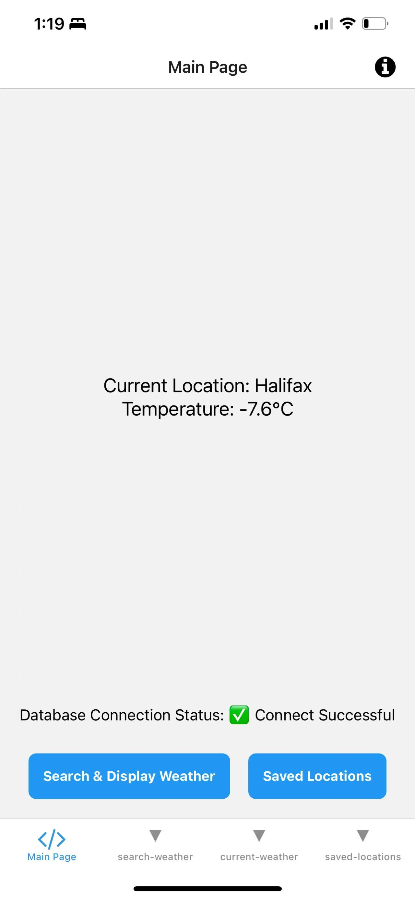
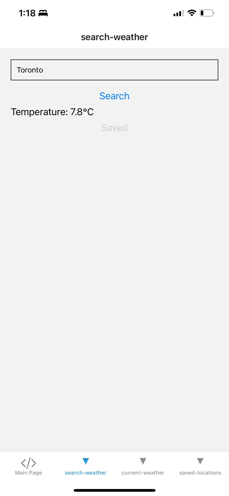
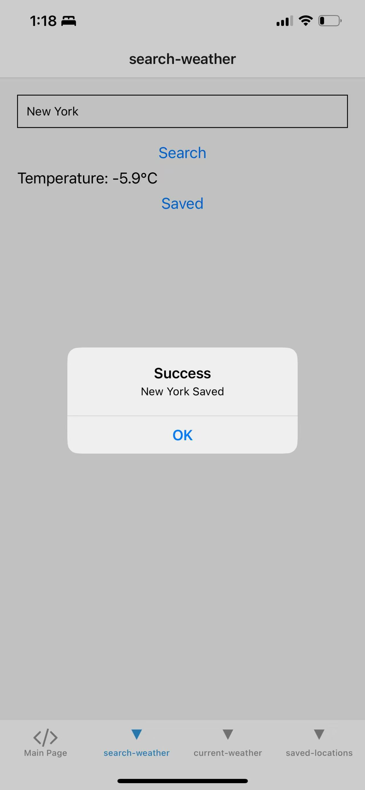
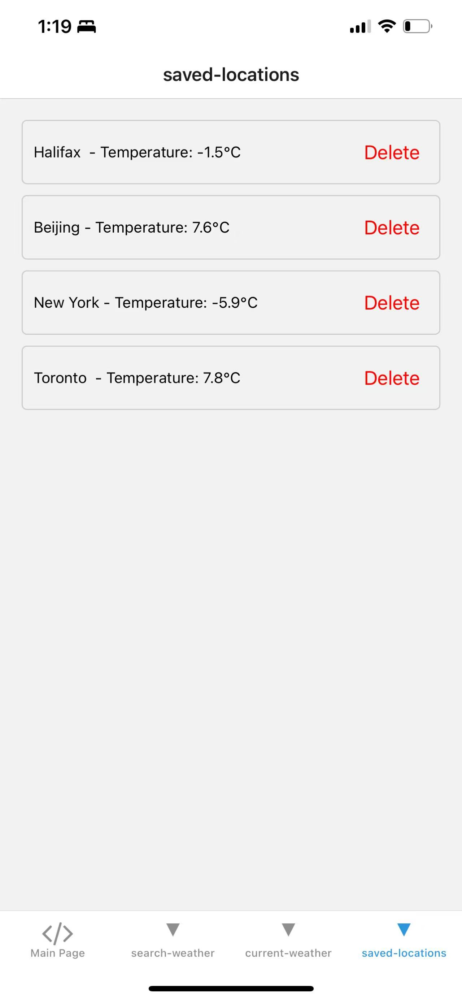
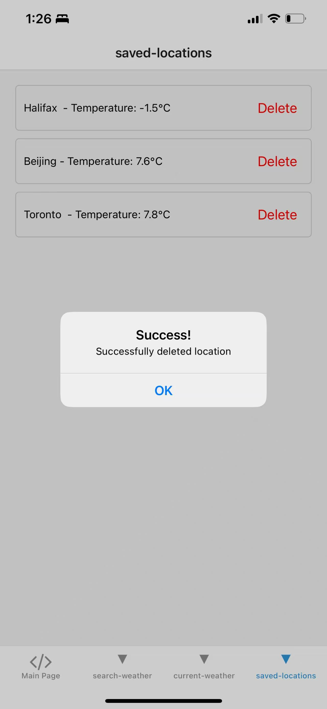

# Weather App - React Native

## Overview
This is a weather application built with React Native and Expo. The app allows users to:
- View the current weather location
- Search for a city's weather
- Save up to 4 favorite locations
- Remove saved locations when needed
- Store data locally using SQLite

## Features
### Current Location Weather
- Automatically fetches the user's location using Expo-Location
- Displays the temperature and weather conditions

### Search and Save Locations
- Users can search for any city and view its weather
- Allows saving up to 4 cities for quick access
- Prevents adding more than 4 locations

### Saved Locations
- Displays a list of stored cities
- Allows users to delete locations
- Updates instantly after adding or removing a location

## Installation & Setup
1. Clone the repository:
   ```sh
   git clone https://github.com/A00488698/ReactNativeAssignment.git
   cd ReactNativeAssignment
   ```
2. Install dependencies:
   ```sh
   npm install
   ```
3. Start the app:
   ```sh
   npm run ios
   ```

## Tech Stack
- **React Native**
- **Expo** (Development framework)
- **Expo-Location** (User's GPS location)
- **Expo-SQLite** (Local data storage)
- **Axios** (API requests)
- **Open Meteo API** (Weather data)


## Running Screenshots
Main Page
Search Page

Save Page
Delete location 
## Notes
- The app was tested on iOS.
- The maximum number of saved cities is **4**.
- Location permission is required for fetching current weather.